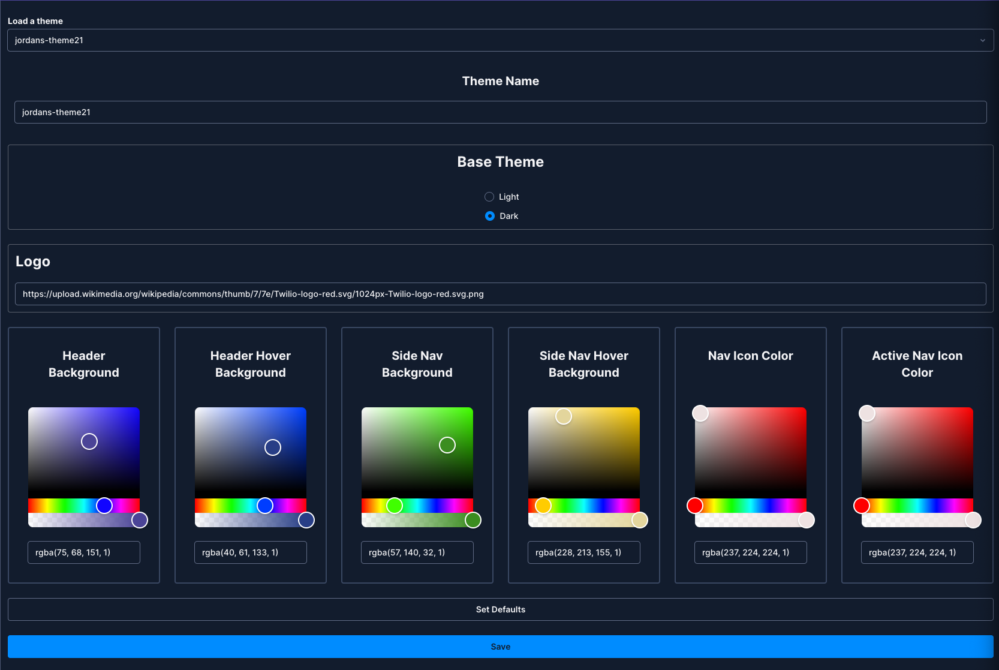

# Twilio Flex UI 2.0 Theme Generator
## Introduction
Twilio Flex allows you to customise elements of your agent UI programatically using the [theme configuration](https://assets.flex.twilio.com/docs/releases/flex-ui/2.0.0-beta.1/theming/Theme). This plugin creates a UI that will allow users to customise the following theme elements:

- Header Background Color
- Header Button Hover Color
- Side Nav Color
- Side Nav Button Hover Color
- Side Nav Icon Colors 
- Dark/Light base theme
- Icon

## Conventions
The plugin has the capability to save and retrieve themes for users within Twilio flex, if there is not a theme for the current user the plugin will attempt to find a theme named 'default' if this does not exist, no theme overrides will be added.

## Persistance Layer
Saving and rereiving is fulfilled via API calls, `/src/API/ImanageTheme.ts` contains an interface that defines the contract required for the persistance service to use. Included in the plugin is an implementation for Google Firebase Realtime Database. However if you would like to bring your own please:

1. Create your own class that implements `IManageThemes.ts`
2. In the file `/src/CreateThemePlugin.tsx` replace the value of `persistanceLayerImplementation` with an instance of your newly created class

This will then be passed as a property to the componenent itselfand your new implementation will be used.